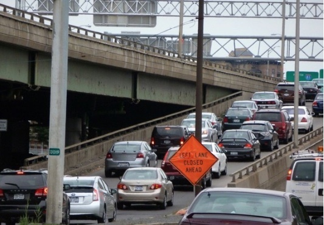
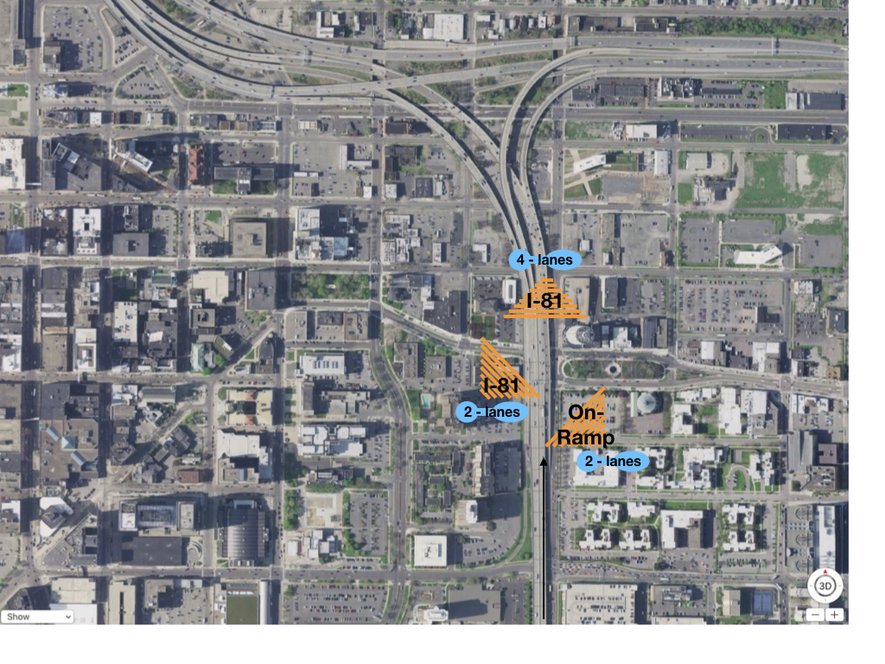

***
[^1]: The __cartools__ functions __crossconflict__, __safecrossover__ and __plotcrossover__ are used to create the plots shown on this page. 

```{r setup, include=FALSE}
knitr::opts_chunk$set(echo = TRUE)
```


```{r, include = FALSE, warning = FALSE, message = FALSE, error = FALSE}
library(Basic)
```

__Lane Changing on a Two-lane Freeway__


Our attention has focused explaining traffic breakdown at a bottleneck. Drivers, who change lanes on a two-lane roadway, can cause traffic breakdown and congestion.  No question drivers must use care when changing lanes to avoid a crash or a near miss. In the simulation shown on this page, we investigate a situation where two drivers are driving side-by-side in lanes 1 and 2. We also assume that the drivers are traveling at identical speeds of $u$ = 67 mph and both decide to change lanes at the same time. Driver 1 moves right from lane 1 to 2 and driver 2 moves left from lane 2 to l. If neither driver yields, then a crash occurs as shown below at the "crossover point." 


```{r crossconflict, echo=FALSE, fig.height=4, fig.width=8, message=TRUE, warning=TRUE}
par(mfrow = c(1,2))
library(Basic)
cartools::crossconflict()
df <- cartools::safecrossover(67,14)
#print(df)
```

To avoid a crash, the driver on lane 2 yields as shown. Driver 2 slows down and allows driver 1 to pass in front of his/her vehicle. Driver 1 maintains a speed of 67 mph.  A crash is avoided. Here we show the driver in the following vehicle to crossover a "safe distance" behind the leader. 

What is a "safe distance?" Since we don't have field measures, we base our assumption and justify it based our experience as  drivers. The distance headway is assumed to be 28 feet or two car lengths. In other words, the distance between the back bumper of the lead vehicle and  front bumper of our vehicle is one vehicle length or 14 feet. Some people may criticize it as being too close given the speeds of two vehicles are 67 mph. However, the relative speed between vehicles  is zero.  

```{r plotcrossover, echo=FALSE, fig.height=5, fig.width=5, message=TRUE, warning=TRUE}
par(mfrow = c(1,1))
library(Basic)
library(ggplot2)
cartools::plotcrossover(67,14)
```

Are the critics right in claiming that we are not cautious enough?  To address the issue, we will investigate our speed and acceleration using the $t-x$ trajectory shown above. Note that the speeds on the plot are shown in feet per second. The relative size of the speed bullets give the impression that we may decelerating at a high rate, suggesting that we may be introducing unsafe condition. At around $t$ = 5 seconds, our speed drops to 56 mph (82 fps) and at around $t$ = 7.5, our speed reaches a maximum of 78 mph (115 fps).  Our acceleration is approximately 8.8 feet per second-square. The accelerate rate is considered comfortable, so we argue that our weave is safe. After all, we are assuming that we are not under the influence of alcohol or drugs, which is obviously against the law.

By the way, a more cautious driver of lane 2 may slow to 56 mph and remain in the lane. 

__Traffic Breakdown and Queue Formation__

While we slowdown "safely," the potential for a traffic breakdown resulting from a crossover by one or two vehicles is evident. Imagine if more vehicles were on the road and our vehicle in lane 2 decelerated as described. Its effect would progress upstream, causing following vehicles to slow. 

The code will be upgraded to include more following vehicles. At the same time, the code for creating the __Conflict__ and __Safe Crossover__ overhead diagrams will be updated. Vehicles  do not follow straight-line trajectories, but curved ones. 

__Roadway Design Effects__

In 2008, the New York State Department of Transportation initiated the I-81 Viaduct Project for downtown Syracuse. One of the five goals of project is to "maintain or enhance vehicle access to the interstate highway network and key destinations (i.e., downtown business district, hospitals, and institutions) within neighborhoods along the I-81 viaduct priority area. [@nydot2018]"

Two options are presently under consideration: (1) to remove the viaduct and replace it with a $\$1B$ "Community Grid", a system of boulevards and one-way streets, and (2) to remove the viaduct and replace it with a tunnel, the cost is not reported. The viaduct replacement option, which has been rejected, was estimated to cost $\$1.4B$. 

Regardless which option is finally chosen, the goals are to: (1) "improve safety and create an efficient regional and local transportation system within and through greater Syracuse," and (2) "provide transportation solutions that enhance the livability, visual quality, sustainability, and economic vitality of greater Syracuse."

The current operation state of the viaduct  can be gleaned from the following photo [@syracuse.com]. The debate is not about replacing the viaduct but choosing an option that meets the goals cost-effectively.




The so-called I-81 bottleneck is non-traditional. There are four lanes upstream and downstream of the so-called bottleneck, therefore it is not declared to be a bottleneck associated with a lane drop.  Its label is  from the fact that there is an excessive amount of weaving between the entrance and downstream fork on the roadway.  



The schematic diagram shows a large red circle indicating the location or a "forced"  weave and driver conflict. Two "forced" weave conflicts are present: (1) drivers entering I-81 from the ramp traveling  west,  and (2) drivers  already on I-81 traveling east. These drivers are forced to change lanes and must proceed with utmost care to avoid crashing. Two smaller red circles are shown as "voluntary" weave locations.  These drivers change lanes in an effort to minimize their travel time. 


```{r roadentrance,  message = FALSE, fig.height = 6, fig.width = 10, echo = FALSE}
x <- c(0,2,2,0,24,26,28,52,50,50,52,28,26,24,0)/40
xfeet <- x*40
y <- c(0,1000,4000,5000,5000,4000,5000,5000,4000,1000,0,0,1000,0,0)/200
df <- data.frame(x,y,xfeet)
op <- par(mfrow = c(1,1), pty = "s")
plot(df[,1], df[,2], typ = "n", axes = FALSE, xlab = "", ylab = "", xlim = c(0, 2.5))
polygon(df[,1], df[,2], col = gray(0.8), border = NA)
lines(df[1:4,1],df[1:4,2])
lines(df[5:7,1],df[5:7,2])
lines(df[8:11,1],df[8:11,2])
lines(df[12:14,1],df[12:14,2])
df1 <- data.frame(x = c(12,14,14,12)/40, y = c(0,5,20,25))
lines(df1[1:4,1],df1[1:4,2], lty = 2)
df2 <- data.frame(x = c(40,38,38,40)/40, y = c(0,5,20,25))
lines(df2[,1],df2[,2], lty = 2)
df3 <- data.frame(x = c(6,8,8,6)/40, y = c(0,5,20,25))
lines(df3[,1],df3[,2], lty = 1, lwd = 3, col = "orange" )
df4 <- data.frame(x = c(18,20,20,18)/40, y = c(0,5,20,25))
lines(df4[,1],df4[,2], lty = 1, lwd = 3, col = "blue" )
df5 <- data.frame(x = c(34,32,32,34)/40, y = c(0,5,20,25))
lines(df5[,1],df5[,2], lty = 1, lwd = 3, col = "green" )
df6 <- data.frame(x = c(46,44,44,46)/40, y = c(0,5,20,25))
lines(df6[,1],df6[,2], lty = 1, lwd = 3, col = "red" )
points(0.65, 13, col = "red", pch = 8, cex = 3)
points(0.35, 13, col = "red", pch = 8, cex = 1.5)
points(0.95, 5, col = "red", pch = 8, cex = 1.5)
points(0.65, 13, col = "red", pch = 16, cex = 2.5)
points(0.35, 13, col = "red", pch = 16, cex = 1.5)
points(0.95, 5, col = "red", pch = 16, cex = 1.5)
lines(df[c(6,13),1],df[c(6,13),2], lty = 2)
legend("topright",legend = c("weave conflicts"),
       pch = 16, col = "red", lty = 8, bty = "n")
title(main = "I-81 Bottleneck")
axis(side = 1, at = c(0.15), labels = "Lane 1", line = -0.5)
axis(side = 3, at = c(0.45), labels = "Lane 2", line = -0.5)
axis(side = 1, at = c(0.85), labels = "Lane 3", line = -0.5)
axis(side = 3, at = c(1.15), labels = "Lane 4", line = -0.5)
par(op)
```

__A LOS Report and BIM__

Construction of the viaduct began in the late 1950's and early 60's. Much has changed since this time and much can be learned from the past. Now, congestion mitigation is a top priority [@cmp2011].

Consider using side fire radar to collect vehicle count $n$, speed $u$, vehicle class data at the three sites show above. These data would certainly go along way in testing our __cartools__ methodology to explain and predict traffic breakdown at a bottleneck.  These data can also be used to prepare a I-81 Viaduct Level-Of-Service  report. A LOS report will complement the NYSDOT I-81 Viaduct Project report that used annual average daily flow as a principal means of reporting LOS. 

Both options under consider are costly. No question that the driving public and taxpayers expect a dramatic decrease in traffic congestion in Syracuse.  Transportation engineers are working toward this end. Regardless, it is interesting in passing to note that one transportation engineering textbook in twelve, listed "traffic congestion" in the index. @banks:1998 states traffic congestion exists when traffic demand exceeds roadway capacity and is found in the problem occurs on urban highway systems, particularly on major highways and intersections on arterial streets. This is certainly the case in Syracuse.

Engineers also want to minimize roadway construction costs. The taxpaying public should be pleased that students are learning "building information modeling."  BIM allows engineers to spend more time evaluating what-if scenarios to optimize the design and less time generating construction documentation [@bim]. Incorporating the information derived from computer __cartools__ simulations into BIM is a possibility that should be explored.

There are three benefits associated with the proposed traffic data collection effort: (1) prepare a LOS report, (2) improve BIM, and (3) test __cartools__.


*** 
__References__