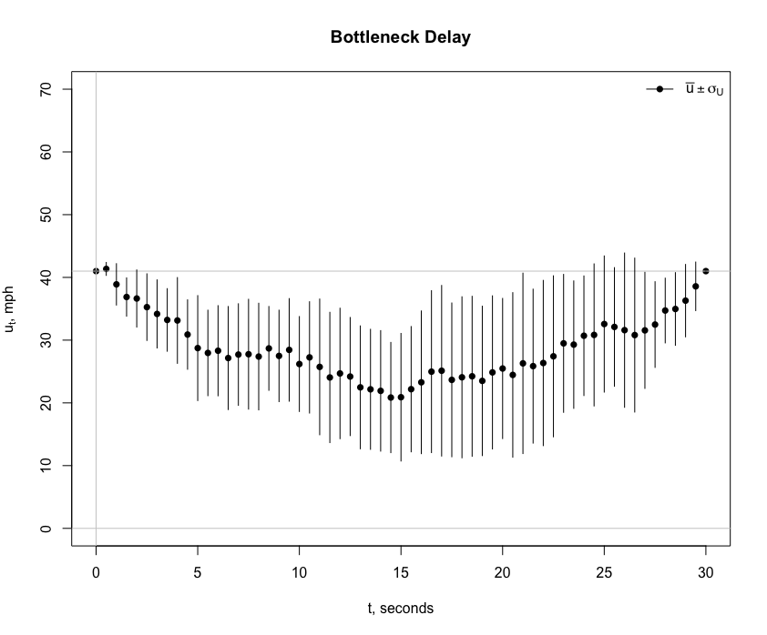

***
[^1]: The __cartools__ functions __usdzipper__, __formqueue__, __freeflowpass__ __passplot__ __brksummary__, __brktrials2__ and __brkdelay__ are used to create the plots shown on this page.  


__Model Types__

We have developed two modeling types to simulate traffic behavior.  Each type realistically simulates conditions found in the field  using $t-x$ trajectories as the principle means of comparison. The models  are fundamentally different. One is a deterministic model and the other is a stochastic model. The forecasts from the two models compliment one another. Both satisfy the principal aim of developing the __cartools__ package: __To explain highway performance as simply as possible.__  

```{r, include = FALSE, warning = FALSE, message = FALSE, error = FALSE}
library(Basic)
```


``` {r table 1, echo = FALSE, message=FALSE, error=FALSE, warning = FALSE}

df1  <- data.frame(c("Microscale time-series", "No", "Sight lines","Safe headway", "No"))
df2  <- data.frame(c("Microscale time-series", "Yes", "Noise","Safe headway", "Yes"))
df   <- cbind(df1,df2)
colnames(df) <- c("Acceleration Model", "Brownian Bridge Model")
rownames(df)  <- c("Description", "Stochastic", "Driver Response", "Driver Risk Aversion", "Empirical Data Link")
knitr::kable(df,  align = "c")
```

The major strength of the  __acceleration model__ is its ability to explain how a driver will vary his or her vehicle speed over time owing to traffic conditions [@LiliBook]. It features a $\ddot{x}(t)$ model, a _non-linear, deterministic model_. 


__Traffic Breakdown Part 1__ 

What is a traffic breakdown?  It is as the transition from a free-flow state to a congested state, $X = 1 \rightarrow X = 0$. The state space notation is simple enough. The groundwork for explaining traffic breakdown was established in the __Car-Following and Traffic Breakdown__ section of  __Bottleneck__. This approach uses a deterministic model.  Explaining traffic breakdown with a stochastic  model is most challenging.

A traffic breakdown event is complicated because there is a myriad of ways a breakdown can be initiated. Weaving, merging, aggressive driving, and poor roadway design are often blamed. To simplify the discussion, we assume that traffic breakdown will occur at a bottleneck. A  two-lane freeway with uni-directional flow merges into a single lane, the so-called "lane drop" problem. Vehicles are forced to merge. For the present, we concentrate on the first two vehicles that decelerate in traffic described to be highly volatile with high density. 

There is uncertainty associated  specifying a  stochastic speed model. Since the __acceleration__ or deterministic $u(t)$ model explains breakdown, we will add random effects component to it [@iacus]. We obtain:

* $U(k, a, b, h_{safe}, t) =  u(0) +  a * t - \frac{b}{2} * t^2 + W(\Delta t)$

where $W(\Delta t) \sim N(0, \sigma \Delta t)$ and  $\sigma = \sigma(k)$. Thus, $U(k, a, b, h_{safe}, t)$ is now a stochastic model with an external data link.  Does it explain breakdown?

Here is the scenario. The following $t-u$ and $t-x$ plots are derived from  a simulation using the $U(k, a, b, h_{safe}, t)$ model.[^1] The simulation is limited to an investigation  of two vehicles, a lead vehicle and a following vehicle, identified as  1 and 2. It is assumed that the drivers of these vehicles will not change lanes. They car-follow exclusively. There are no drivers outside their driving lane. Thus, conditions that describe a zipper merge do not apply here.  Even with these simplifying assumptions, there is quite a bit going on during a traffic breakdown. 

```{r usdzipper,  message = FALSE, fig.height = 8, fig.width = 10, echo = FALSE}
par(mfrow = c(1,1))
set.seed(124)
output1 <- usdzipper(0, 5, 41, 11.6, 0, 500)
```

Since  traffic is highly volatile, the first step is to simulate field conditions. We assume the traffic density is fixed, $K = k$ = 50 vpm. Thus $\bar{u} \pm \sigma = 41 \pm 11.6$ mph. Since $X = 1 \rightarrow X = 0$, the speeds of the two vehicles before and after breakdown must satisfy the constraints $u(t_{start}) > u^*$ and $u(t_{end}) \le u^*$ where the time at the start and end of the simulation are $t_{start}$ = 0 and $t_{end}$ = 5 seconds. These values were estimated by drawing samples from a simulated data set consisting of one hundred draws from the normal distribution of $N(\bar{u} = 41, \hat{\sigma}^2 = 11.6^2)$. Four draws were made from the simulated data. They are shown in the following table. 

``` {r table 2, echo = FALSE, message=FALSE, error=FALSE, warning = FALSE}

df1  <- data.frame(c("0", "55 mph (81 fps)", "0 feet", "57 mph (83 fps)", "-68 feet"))
df2  <- data.frame(c("5 seconds", "41 mph (60 fps)", "500 feet", "32 mph (47 fps)", "455 feet"))
df   <- cbind(df1,df2)
colnames(df) <- c("Start", "End")
rownames(df)  <- c("Time t", "Vehicle 1:  u", "Vehicle 1:  x",  "Vehicle 2:  u", "Vehicle 2:  x")
knitr::kable(df,  align = "c")
```

Note that at the start of the simulation, $t_{start} = 0$, that vehicle 2 is traveling at a speed slightly greater than vehicle 1. At the end of the simulation, $t_{end}$ = 5 seconds, the opposite is true.  The simulation also shows driver 2 is traveling at higher speed than driver 1 for the first three seconds. Driver 2 begins to  decelerate around three seconds to maintain a safe headway at $t_{end}$. Speed volatility explains these findings. Another simulation will be different.

The second step is to estimate model parameters $a$ and $b$ for each of the two vehicles. Other assumptions must be must made. The bottleneck is assumed tapper down from two to one lane in 500 feet and the total time for the breakdown is 5 seconds. The drivers are assumed to be risk averse so driver of vehicle 2 maintains a safe headway. All this information is summarized in the table. The $t-x$ trajectory shows vehicle 2 maintains a safe headway for the entire 5 seconds of the simulation. 

The same numerical integration scheme described earlier for determining $x_t$ trajectories for the ring-road is used here. Like the ring-road, the $t-x$ trajectories are smooth, suggesting the speeds at times $t_0$ and $t_{end}$ are more critical than the speed changes caused by Brownian motion $W(t)$ ranging over the interval $t_{start} < t < t_{end}$. 

__Traffic Breakdown Part 2__ 

The importance of maintaining a safe headway cannot be overemphasized. Without this assumption, the $t-x$ trajectory of vehicle 2 could cross the trajectory for vehicle 1. The result is a rear-end crash caused by _tailgating._ This possibility of  a rear-end crash can occur even when there is a safe headway at $t_{start}$ = 0 and $t_{end}$ = 5. Let's see.

The following simulation shows a near-miss caused by _tailgating._ While the trajectories do not cross, the $t-x$ trajectories shows a safe headway violation between three and four seconds. Since drivers are assumed to risk averse, it is not unreasonable to assume the driver of the following vehicle will decelerate. In other words, not violate the safe headway assumption. To keep the discussion as simple as possible, the safe sight-line assumption for times $0 < t < t_{end}$, discussed in the __Bottleneck__ section,  is not imposed here. 


```{r usdzipper2,  message = FALSE, fig.height = 5, fig.width = 10, echo = FALSE}
par(mfrow = c(1,1))
set.seed(129)
output1 <- usdzipper(0, 5, 41, 11.6, 0, 500)

```

__Traffic Breakdown Part 3__ 

How is a traffic breakdown initiated in the first place? So far, we have tacitly assumed the lead vehicle decelerates from $u_{start} > u^*$ and $u_{end} < u^*$. Now we tackle a most challenging question. Instead of assuming to watch vehicles pass us from the road side, we will position ourselves overhead by analyzing photographs taken from a helicopter or drone flying overhead. 

```{r formqueue,  message = FALSE, fig.height = 5, fig.width = 8, echo = FALSE}
par(mfrow = c(1,2))
set.seed(129)
output1 <- formqueue(0, 10, 55, 11.6, -1000, -500, 14)
```

Here, the following graph shows two lanes of traffic merging into one lane. There is no  traffic breakdown in this simulation. No queue forms. All drivers maintain free-flow speeds,  $u > u^*$ where $u = \bar{u}$ = 55 mph. As above, we simulated speed using the $U(k, a, b, h_{safe}, t)$ model. To maintain a $X = 0$ state, all drivers of following vehicles keep a safe headway. This result is most vividly seen downstream where $x > 0$ where the vehicles travel in one lane. 

Since is controversy associated with the proper positioning of roadside equipment, it is interesting to note the following:

* $Q = Q(x > 0) = Q(x \le 0)$

because $k$ = 50 vpm is a constant and $\bar{u}$ is the same value both downstream and upstream  of $x = 0$. Thus, $Q = k * \bar{u}$ where $k = \frac{n}{l}$ and $n$ is the total vehicle count obtained from the photo. A roadside collection of data taken any position on the photo downstream or upstream of $x = 0$ gives the same result. We look at the controversy again after we answer the question: How is a traffic breakdown initiated in the first place?

__Traffic Breakdown Part 4__ 

The __Zipper Merge__ graph  demonstrates the importance of upstream vehicle alignment  and the effects of noise of  merging vehicle at a bottleneck over time. The spacing between  vehicles is nonuniform and vehicle grouping is virtually impossible to predict. 

A zipper merge is a special case because the upstream vehicles are aligned in a manner that it is unnecessary for vehicles to change speed. Now, we eliminate this assumption and put drivers under the stress by requiring a speed change of only one vehicle. Since our analysis takes place where the chance of a traffic breakdown is significant, $k = 50$ vpm, the action of this driver may trigger a breakdown event causing a queue to form that moves upstream from $x$ = 0.    

To simplify the discussion, the effect of noise will be temporarily removed from the following  "thought experiment." This step may seem odd given the emphasis placed on stochastic modeling. After we complete the analysis, we will be in a better position to understand breakdown. More specifically, explaining and coming closer to reliably predicting  the role that traffic noise plays in triggering breakdown. In other words, determine if traffic noise is a major or minor factor in explaining and predicting breakdown.

We will continue to observe vehicles from overhead. But this time, we will follow the actions of only two drivers, who are traveling side-by-side in lanes 1 and 2 at  $x = -500$   feet, the beginning of the merge section where freeway tappers down from two to one lane. The side-by-side vehicles, like the rest of the vehicles traveling in the direction of the bottleneck, are traveling at speed $u$ = 55 mph. The driving scenario is similar to one described above before being transformed from a free-flow to congested state, $X = 0 \rightarrow X = 1$. 

Since the two drivers are side-by-side, one must make the decision to be the leader or follower. The choices are: (1)  __accelerate and merge__ and become a leader, or (2) __decelerate and merge__ and become a follower. In either case, the drivers will do so safely. They will  maintain a safe headway of at least $h_{safe} = 53$ feet for speed of $u$ = 41 mph. 
Most importantly and regardless of choice, the decision-maker does not want to disrupt the speeds of the other drivers, which are assumed to be traveling at $u$ = 41 mph. The aim is to cause no further disruption or delay. In essence, the decision-maker wants to perform a zipper merge.


A series of photographs are taken  for the two drivers in the two cases.  Speed and location recordings are made  every second over a period of 50 seconds. The data are analyzed and summarized as shown below in the $y-x$ plots. Since the location $x$ is measured in feet, speed $u$ is shown in feet per second (fps).


```{r freeflowpass,  message = FALSE, fig.height = 4.5, fig.width = 4, echo = FALSE}
par(mfrow = c(1,2))
library(glm2)
library(ggplot2)
library(Basic)
df1 <- freeflowpass(0, 10, 55, 0, -1000, -500, 14)
passplot(df1, title = "Accelerate and Merge")


df2 <- decelmerge(0, 10, 55, 0, -1000, -500, 14)
passplot(df2, title = "Decelerate and Merge")


```

Regardless of the action taken, the aim of the decision-maker is achieved. The driver does not disturb the other drivers. No queue is formed. The __accelerate and merge__ driver reaches a maximum speed of 50 mph (103 fps) and the __decelerate and merge__ driver reaches a minimum speed of 40 mph (58 fps). The acceleration and deceleration rates are approximately equal to 7  and -7 ft/sec$^2$, respectively. A maximum comfortable decelerate is considered to be 15 ft/sec$^2$. Since all drivers are maintaining safe head-ways,  no crash or near miss incidents are predicted. 


__Traffic Breakdown Part 5__ 

Ignoring traffic noise is an ideal scenario and totally unrealistic. There is little doubt that the root cause traffic breakdown must consider traffic noise. 

There are other factors that must be considered. Take for example, the safe headway $h_{safe}(u, l_{eff})$ assumption. Drivers will not only self optimize but will be risk averse, they seek comfort. We are hard pressed to find a real world situation where two drivers will maintain a safe headway of $h_{safe}$ = 67 feet as shown in the $y-x$ plots $x > 0$, downstream of the bottleneck. Tailgaters may not abide by this rule of keeping three cars lengths between themselves and the vehicle in front of them. Drivers of the lead vehicle will feel more comfortable with $h_{safe}$ = 106 feet, more than six car lengths between the lead and following vehicles, as shown for $x \leq -500$  feet. 

This critique of the deterministic model and subsequent model developments brings into question what are the conditions are necessary for a decision-making driver to take action. For $-500 \le x \le 0$ feet, it was assumed that the safe headway $h_{safe}(u, l_{eff})$ assumption was always sufficient. A decision-making driver, who is not comfortable with the rule, has the option to stop and trigger a breakdown event. The challenge is to develop a stochastic model of the form:

* $U(k, a, b, h_{safe}, h_{comfortable}, t)$.

__Traffic Breakdown Part 6__ 

To trigger a traffic breakdown and to initiate queue formation, a roadway system must be under stress. Even though we are investigating a simple roadway geometry, the system is under stress: (1) the traffic density is high, $k$ = 50 vpm, (2) vehicles are forced to merge because of a lane drop, (2) traffic volatility is high, $\sigma$ = 11 mph = 16 fps, for an average speed $u$ = 41 mph = 60 fps, (3) vehicles are closely spaced thus limiting  drivers' options to maneuver and finally, (4) drivers desire to self optimize work against them putting the system under added stress. In the following simulation, two  of  three vehicles are traveling side-by-side before they enter the merge zone of a bottleneck. To avoid a crash, one driver must yield and decelerate. Given this combination of factors, traffic breakdown is expected. The chance of a breakdown is $\pi(k = 50)$ = 0.8. Once breakdown is triggered, a queue forms and grows steadily over time.    
 
Let us look at the action of the three drivers, who we identify by vehicle number. Their individual action  over time is important. Initially at time $t_0$ = 0 seconds, the distance between vehicles 0 and 1, which is directly behind, is $h_0$ = 105 feet, a space headway estimated as $h_0 = 1/k$. $h_0$ is almost twice the safe headway $h_{safe}$ for an average speed of $u$ = 41 mph = 60 fps at this density. The positions of the three vehicles at $t_0$ = 0 seconds is shown under the table column heading $x_0$. The table shows there is no conflict between vehicles 0 and 1 and indicates that vehicle 0 can move freely downstream through the merge zone, $-500 < x \le 0$. Since the driver has no conflicts, we call it a _zipper merge_. The slope of the $t-x$ trajectory appears to be steady. However, the table shows the driver to be increasing his or her speed. At times $t_{start}$ = 6 seconds and $t_{end}$ = 14.5 seconds, the vehicle has accelerated from $u_{start}$ = 64.7 fps and $u_{end}$ = 74.4 fps.  Times $t_{start}$ and $t_{end}$ are the times when the vehicle enters and exits the merge zone. 


``` {r table 3, echo = FALSE, message=FALSE, error=FALSE, warning = FALSE}
df7  <- data.frame(c("0", "1", "2", "2"))
df9  <- data.frame(c(-895, -1000, -1000, -1000))
df0  <- data.frame(c("No","Yes","Yes","Yield"))
df8  <- data.frame(c("_Zipper_","_Leader_","","_Follower_"))
df1  <- data.frame(c("6", "8.5", "8", "8"))
df2  <- data.frame(c("14.5", "16", "16.5", "16"))
df3  <- data.frame(c("64.7", "62.2", "81.9", "81.9"))
df4  <- data.frame(c("74.4", "53.0", "56.9", "53.0"))
df5  <- data.frame(c("-515", "-501", "-508", "-508"))
df6  <- data.frame(c("-27.3", "-26.4", "-28.9", "-91.0"))
df16   <- cbind(df7,df9,df0,df8,df1,df2,df3,df4,df5,df6)
colnames(df16) <- c("Vehicle","$x_{0}$", "Conflict","Resolution", "$t_{start}$", "$t_{end}$","$u_{start}$", "$u_{end}$","$x_{start}$", "$x_{end}$")
knitr::kable(df16,  align = "c")
```

The situation for drivers of vehicle 1 and 2 is different. There is no conflict upstream of the bottleneck for $-1000 < x < -500$ feet. The trajectories over this range overlap but there is no conflict because the vehicles are traveling in separate lanes. After $x$ = -500 feet, a conflict exists. Vehicle 1 becomes the _leader_ of this pair of vehicles. Its trajectory is similar to vehicle 0 in the sense that the driver travels forward unimpeded. Note its speeds through the merge zone are $u_{start}$ = 62.2 fps and $u_{end}$ = 53.0 fps, respectively.
 

```{r brksummary,  message = FALSE, fig.height = 4.5, fig.width = 6, echo = FALSE}
par(mfrow = c(1,1))
library(glm2)
library(ggplot2)
library(Basic)
set.seed(123)
lst <- brksummary(50, 30, 41, 11, -1000, -500,  14, 0, 0.5)
title(main = "Breakdown")

```

Vehicle 2, the _follower_, decelerates from a speed of $u_{start}$ = 81.9 fps to $u_{end}$ = 53.0 fps. The latter speed of 53.0 fps is exactly the same speed as vehicle 1 at $t_{end}$ = 16 seconds. The distance between the two vehicles at   this time is the safe headway distance $h_{safe}$ = 64.6 feet. The red and blue solid circles draw attention to this fact. The red $t-x$ trajectory shows the curve to cross the blue trajectory for vehicle 1 at two places. At the first crossing at around $x$ = -250 feet, the following $y-x$ shows the center-line of the two vehicles to be separated by 6 feet. The slopes of the $t-x$ trajectories for vehicles 1 and 2 suggest that vehicle 1 is accelerating and vehicle 2 is decelerating at this point in time.

The red trajectory  shows vehicle 2 to cross the trajectories of vehicles 0 and 1. This does not mean the vehicle is crashing into these vehicles. Its meaning is quite the opposite. It shows that once a vehicle passes the bottleneck $x$ = 0 that drivers tend to accelerate and seek higher speeds. In this instance, the driver of vehicle 2 is passing vehicles 0 and 1 in the opposing lane that is free of traffic.

```{r passplot,  message = FALSE, fig.height = 4.5, fig.width = 5, echo = FALSE}
par(mfrow = c(1,1))
library(glm2)
library(ggplot2)
library(Basic)
set.seed(123)
#passplot(df, title = "Breakdown")
#print(lst[[2]])
```

To keep the discussion as simple as possible, we investigated three vehicles. Since their trajectories satisfy the safe headway conditions, all three drivers are driving safely. Now, imagine that vehicle 3 and 4 enter the simulation. Given that the two self-optimizing drivers will maintain a safe head-ways between themselves and the vehicles in front them as we described for car-following. These drivers also have the option to maintain a $1/k$ headway described above. In either case, vehicles 3 and 4 are suspected to driving side-by-side especially as they approach $x = -500$ feet. Using the $1/k$ headway estimation method, they will be located at $x = -1105$ feet at $t = 0$ and the two drivers of vehicles 3 and 4 will be in a position to decide which one take on the role of leader or follower. In other words, we can repeat the analyses as above for vehicles 1 and 2. The net result is the system will remained in a stress condition. The queue will grow and speeds will continue to decline in magnitude. Eventually, the speeds will decline to values to values that we define as congested. We experience the transition, $X = 0 \rightarrow X = 1$.

__Traffic Breakdown 7__

Now, we will introduce two more vehicles to our simulation showing the effects of traffic volatility on traffic breakdown. Unlike the above simulation and owing to car-following restrictions, we will not allow  vehicles to pass one another.  These restriction are placed upstream and downstream of the merge zone: (1) upstream of $x$ = -500 feet where the vehicles start to merge, and (2) downstream of $x$ = 0 where the roadway is reduced  to one lane. 

While these restrictions seem harmless enough, but they place an extra burden on the model in analyzing the interaction of each leader/follower pair. Like above, each driver is allowed to be a self optimizer and seek a path to minimize his or her travel time.  The following set of $t-x$ trajectories illustrate the situation for one simulation. Keep in mind that assigning a different random seed the algorithm will give an entirely different set of trajectories. Presently, we will conduct an experiment consisting of 10 simulations. Right now, we are analyzing one simulation or sample in the experiment.

Let us proceed to explain the traffic breakdown process by investigating each panel from top to  bottom. The panel titles and legends  in the top-left  help describe the different phases of a merge. 

```{r bottleneck_merge,  message = FALSE, fig.height = 12, fig.width = 8, echo = FALSE}
par(mfrow = c(1,2))
library(Basic)
library(rlist)
set.seed(127)
lane <- c(1,1,2,1,2)
xstart <- c(-900, -995, -1000, -1090, -1100)
brktrials2(30, 41, 11, xstart, -500, 14, lane, 0.5, 2) -> output
```


__Driver Conflicts:__  The trajectory in the top panel, the lead vehicle, which is shown by a solid line and is identified as vehicle 1 or driver 1. The driver  is unconstrained because his or her vehicle arrives first at $x$ = -500 feet and secondly, there is no vehicle in front of it to impede its progress. 

Vehicles  2 and 4, which are traveling in lane 1, and  vehicles  3 and 5, which are traveling in lane 2, are impeded.  These vehicle would follow the broken-line trajectories if they were not impeded. Let us investigate the conflict of each driver  in turn. Keep in mind that the broken-lines are considered "desire" trajectories, trajectories the driver would follow if they were not impeded.

To avoid a crash, driver 2 must reduce  his or her vehicle speed before entering  the merge zone. Midway through the merge zone the driver can accelerate as shown by its broken-line trajectory. Now treating its broken-line trajectory past the bottleneck at $x$ = 0 as a "desire" line, driver 2 would be well downstream at $t$ = 30 seconds. In fact, it would be located downstream of vehicle 1. This is impossible. Driver  1 blocks driver 2. 

Following the broken-line trajectories of drivers 3 and 4 shows neither of them  are impeded. They are both content with the driving situation presented to them. Why? Treat their trajectories as "desire" lines. Both would reach their desired $x$ locations as shown at time $t$ = 30 seconds.  

Driver 5 is an aggressive driver like driver 2. Unlike driver 2, driver 5 desires to accelerate through the merge zone and then slow down and reach approximately the same $x$ location  as driver 2  at time $t$ = 30 seconds. Driver 5 is blocked by driver 3 before his or her vehicle reaches $x$ = -500 feet the merge zone.

__Lanes 1 and 2:__ The effects of car-following are shown in the drivers 4 and 5 trajectories. Driver 2 blocks driver 4 in lane 1. Driver 4 must slowdown to avoid tailgating, i.e., the $h_{safe}$ rule is imposed on driver 4. For the same reason, driver 5 blocks driver 3 in lane 2. 

__Car Following Constraints:__ The effects of imposing the $h_{safe}$ rule and the non-linear acceleration model,  $\ddot{x}(t)  = a - b * t$, for the merge zone are shown here.  These constraints, which may slow vehicles down, also affects  the order that vehicles travel through the merge zone and proceed downstream. The sort order by vehicle number is shown at $t$ = 30 seconds. At this point in the analysis, the car-following constraint is not imposed on driver 2 as shown by the broken-line. Once this correction is made, all phases of the merge are completed.

__Model Predictions:__ In the final analysis, driver 1 is the leader followed by drivers 2, 3, 5 and 4 in that order. Speeds decline for  following  drivers 3, 4 and 5 because of driver 2 impedes their progress. The queue begins to form at $x$ = -500 feet owing to  driver 2.  Even though driver 1 is the leader, he or she has no or little impact on the following drivers. Driver 2, on the other hand, has a major impact on this merge.

It is not hard to imagine and to hypothesize that queue formation and driver delay would be initiated in the middle of the merge zone for other simulations. The following simulation of 10 vehicles suggests that the hypothesis has merit.

```{r bottleneck_merge2,  message = FALSE, fig.height = 6, fig.width = 8, echo = FALSE}
par(mfrow = c(1,2))
library(Basic)
library(rlist)
set.seed(124)
lane <- c(1,1,2,1,2,1,2,1,2,2,1,2,1,2)
xstart <- c(-900, -995, -1000, -1090, -1100,-1200, -1220, -1320, -1400, -1660,-1490,-1760,-1590,-1830)
brktrials2( 45, 41, 11, xstart, -500, 14, lane, 0.1, 1) -> output
```

_As you can see, the code must be robust to account for various interactions that  drivers face when merging  in dense and volatile traffic . More debugging is necessary to remove quirky behavior exhibited in_ __brktrails2.__ _For instance, some vehicles are incorrectly backing up! The Brownian motion model needs to be refined. Our intention is to have a fluid work platform. Therefore, corrections and refinements to the code are expected._ 

Regardless, the __brktrials2__ function shows queue  formation to be a function of traffic density and traffic volatility. Don't forget that there is a strong association between traffic volatility and driver behavior. We can identify the actions of individual drivers and actions one or two drivers can adversely affect the rest. Does the __brktrials2__ function adequately explain this behavior? Yes, we think so. Can it be improved? Definitely.

__Delay:__ How do we summarize this behavior in a meaning way? This is a tough question because it is different to come to grips with the uncertain nature of a single breakdown. For the present, we will look at expected delay from 10 simulations. We  defer questions dealing with queue length and congestion relief, which are connected.

Delay is defined to be a speed drop, an expected value.  The following graph shows the estimated speed drop to be 21 mph. The speed drops on average from 41 mph to about 20 mph. 


```{r delay,  message = FALSE, fig.height = 6, fig.width = 8, echo = FALSE}
#par(mfrow = c(1,2))
#library(Basic)
#set.seed(127)
#lane <- c(1,1,2,1,2,1,2,1,2,2,1,2,1,2)
#start <- c(-900, -995, -1000, -1090, -1100,-1200, -1220, -1320, -1400, -1660,-1490,-1760,-1590,-1830)
#brkdelay(2, 30, 41, 11, xstart, -500, 14, lane, 0.5) -> output

```




Given $\pi(k)$ = 0.8 at $k$ = 50 vpm and $\bar{u} \pm \sigma$ is so wide, the results from two independent analyses taken together suggest a congestion event $X = 1$ will occur around 80$\%$ of the time.  

__Conclusions__ 

Traffic noise explains delay and queue formation. High traffic density can be blamed for the loss in performance downstream of $x > 0$. 

Remove noise and all drivers benefit as described above by the zipper merge of __Part 3__.   Does the simulation suggest that expanding the number of lanes downstream of the bottleneck to reduce land traffic density is a good solution? Good question. History shows that it is not a good idea. What can be done? Public transportation is one answer.

The simulation suggests that _removing or mitigating traffic noise that the driving  world would be a better place._ We look at that possibility by looking at Intelligent Transportation Systems (ITS) and the notion of Smart Cities.

*** 
__References__